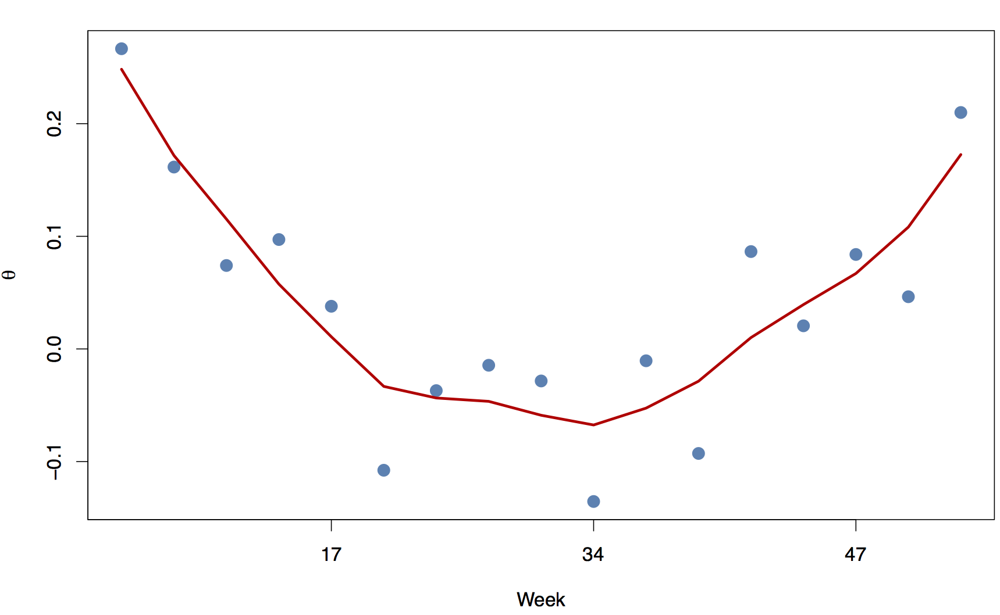

[](http://quantlet.de/index.php?p=info)

## [](http://quantlet.de/) **PGFP_Pricing_week** [](http://quantlet.de/d3/ia)


```yaml
Name of Quantlet: PGFP_Pricing_week

Published in: Pricing Green Financial Products  

Description: ‘Stochastic pricing and calibration of risk premium. Out-of-sample backtesting for price prediction using zero MPR, constant MPR, smooth MPR. Sensitivity test with cross-validation.’ 

Keywords: ‘MPR, OLS, smoothing, backtesting, cross-validation, benchmark, rmse, mape’ 

Author:   Awdesch Melzer 

Datafile: NQPweek.RData, armal.RData, pq.RData, windforpricing.RData, windforpricing2016.RData

Example: ‘MPR’ 

```


```R
graphics.off()
rm(list=ls(all=TRUE))

setwd()

# install and load packages
libraries = c("msm")
lapply(libraries, function(x) if (!(x %in% installed.packages())) {
  install.packages(x)
})
lapply(libraries, library, quietly = TRUE, character.only = TRUE)

# set dates of delivery periods of monthly contracts
dates1=(array( c(20160119, 20160126, 20160301, 20160308, 20160412, 20160419, 20160524, 20160531, 20160705, 20160712, 20160816, 20160823, 20160927, 20161004, 20161108, 20161115, 20161220),dim=c(17,1)))
dates2=(array( c(20160129, 20160205, 20160311, 20160318, 20160422, 20160429, 20160603, 20160610, 20160715, 20160722,
 20160826, 20160902, 20161007, 20161014, 20161118, 20161125, 20161230),dim=c(17,1)))

price.hat=matrix(NA,nrow(dates1),ncol(dates1))

load("pq.RData")
p = pq$p
q = pq$q
load('armal.RData')
if(p == 2 & q == 0){
  # Matrix of CAR(2) coefficients
  alpha.1 = 2-coefficients(arma.Bs)[1];
  alpha.2=alpha.1-coefficients(arma.Bs)[2]-1;
  A=matrix(c(0, 1, -alpha.2, -alpha.1),2,2,byrow=T);
} else if(p==3 & q==0){
  # Matrix of CAR(3) coefficients
  alpha.1 = 3-coefficients(arma.Bs)[1];
  alpha.2 = 2*alpha.1-coefficients(arma.Bs)[2]-3;
  alpha.3 = alpha.2+1-alpha.1-coefficients(arma.Bs)[3];
  A       = matrix(c(0, 1, 0, 0, 0, 1, -alpha.3, -alpha.2, -alpha.1),3,3,byrow=T);
} else if(p==4 & q==0){
  # Matrix of CAR(4) coefficients
  alpha.1 = 4- coefficients(arma.Bs)[1]
  alpha.2 = 3*alpha.1 - coefficients(arma.Bs)[2] - 6
  alpha.3 = 4 + 2*alpha.2 - coefficients(arma.Bs)[3] - 3*alpha.1
  alpha.4 = alpha.3 - coefficients(arma.Bs)[4] - alpha.2 + alpha.1 - 1
  A       = matrix(c(0, 1, 0, 0, 0, 0, 1, 0, 0, 0, 0, 1, -alpha.4, -alpha.3, -alpha.2, -alpha.1),4,4,byrow=T)
}

d  = eigen(A);
pp = nrow(A)
ep = c(rep(0,pp-1),1)
e1 = c(1, rep(0,pp-1))

load("NQPweek.RData")
load('windforpricing2016.RData')
load('windforpricing.RData')

# select feasible contracts
dates   = as.numeric(as.character(y.2016[,2]))
dates   = dates[dates>=20160101&dates<=20161231]

file2 = subset(finNQP,(as.numeric(as.character(finNQP[,2]))>=20160101)&(as.numeric(as.character(finNQP[,5]))<20170101))

for(i in ncol(file2)){
  file2[,i] = as.numeric(as.character(file2[,i]))
}

dates   = as.numeric(as.character(y.2016[,2]))
dates   = dates[dates>=20160101&dates<=20161231]

y.2016[,1] = windforpricing[nrow(windforpricing),1]+as.numeric((y.2016[,1]))

z.wind = matrix(0,nrow(windforpricing)+nrow(y.2016),ncol(windforpricing))

for(i in 1:ncol(y.2016)){
  z.wind[,i] = c(as.numeric(as.character(windforpricing[,i])),as.numeric(as.character(y.2016[,i])))
}

# pricing
price = matrix(NA,nrow(dates1),ncol(dates1))
rp    = matrix(NA,nrow(dates1),ncol(dates1))
Y     = matrix(NA,nrow(dates1),ncol(dates1))
W     = matrix(NA,nrow(dates1),ncol(dates1))
sigma = matrix(NA,nrow(dates1),ncol(dates1))
for (i in 1:ncol(dates1)){
  for (j in 1:nrow(dates1)){
    beg        = dates1[j,i]
    en         = dates2[j,i]
    it         = which(z.wind[,2]==beg)
    itau1      = it
    itau2      = which(z.wind[,2]==en)
    price[j,i] = mean(file2[which(file2[,4]==beg&file2[,5]==en),3])
    if (length(itau2)==0){
      price.hat[j,i]=NA
    } else {
      season = sum(z.wind[itau1:itau2, 5])/length(itau1:itau2)
      Y[j,i] = sum(z.wind[itau1:itau2, 3])/length(itau1:itau2)*100
      W[j,i] = unique(file2[which(file2[,4]==beg&file2[,5]==en),1])
    if(ncol(A)==2){
      x = c(z.wind[it-2,6], z.wind[it-1,6])
    }
    if (ncol(A)==3){
      x = c(z.wind[it-3,6], z.wind[it-2,6], z.wind[it-1,6])
    }
    if (ncol(A)==4){
      x = c(z.wind[it-4,6], z.wind[it-3,6], z.wind[it-2,6], z.wind[it-1,6])
    }
    ax             = e1%*%solve(A)%*%(MatrixExp(A*(itau2-itau1))-diag(1,nrow(A),ncol(A)))%*%x/length(itau1:itau2)
    sigma[j,i]     = ((1+exp(-(e1%*%solve(A)%*%(MatrixExp(A*(itau2-itau1))-diag(1,nrow(A),ncol(A)))%*%ep*sum(z.wind[itau1:itau2,7])/length(itau1:itau2))))^(-1)*100)
    price.hat[j,i] = ((1+exp(-(season+ax)))^(-1)*100)
    }
    if (is.na(price[j,i])==FALSE){
      rp[j,i] = price[j,i]-price.hat[j,i]
    }
  }
}
rpma=matrix(NA,7,1)
for (i in 1: nrow(rp)){
  rpx     = rp[i,]
  rpx     = rpx[is.na(rpx)==FALSE]
  rpx     = mean(rpx)
  rpma[i] = rpx
}
plot(price,ylim=c(min(price,price.hat), max(price, price.hat)))
lines(price.hat)


rmse = function(y, yhat){
  return(sqrt(1/length(y)*sum((y-yhat)^2)))
}

mae = function(y,yhat){
  return(mean(abs(y-yhat)))
}

mape = function(y,yhat){
  return(mean(abs((y-yhat)/y))*100)
}

mse = function(y,yhat){
  return(mean((y-yhat)^2))
}

burn = c()
# Burn-in Analysis: theta = 0
burn[1] = mape(price,price.hat)
burn[2] = mape(Y,price.hat)
burn[3] = mape(Y,price)
burn[4] = rmse(price,price.hat)
burn[5] = rmse(Y,price.hat)
burn[6] = rmse(Y,price)

theta = rp#/sigma
# Constant MPR
CMPR = coef(lm(theta~1))
price.hat.CMPR  = price.hat + CMPR#*sigma
CMPR
const = c()

const[1] = mape(price,price.hat.CMPR)
const[2] = mape(Y,price.hat.CMPR)
const[3] = mape(Y,price)
const[4] = rmse(price,price.hat.CMPR)
const[5] = rmse(Y,price.hat.CMPR)
const[6] = rmse(Y,price)

smoothie = c()
smMPR = smooth.spline(x=theta,spar=0.45)
par(cex=1.3)
plot(theta,pch=16,col="steelblue",cex=1.5,ylab=expression(theta),xlab="Week",frame=T,axes=F)
axis(2,seq(-15,30,by=5))
axis(1,seq(0,18,by=5),W[seq(0,18,by=5)+1,])
lines(smMPR$y,type="l",col="red3",lwd=3)
RP = smMPR$y
mean(RP)
price.hat.smMPR = price.hat + RP#*sigma
smoothie[1] = mape(price,price.hat.smMPR)
smoothie[2] = mape(Y,price.hat.smMPR)
smoothie[3] = mape(Y,price)
smoothie[4] = rmse(price,price.hat.smMPR)
smoothie[5] = rmse(Y,price.hat.smMPR)
smoothie[6] = rmse(Y,price)

library(xtable)
MAPE = cbind(burn[3:1], const[3:1], smoothie[3:1])
xtable(MAPE,digits=3)
RMSE = cbind(burn[6:4], const[6:4], smoothie[6:4])
xtable(RMSE,digits=3)

# Burn-in Analysis: theta = 0
mape(price,price.hat)
mape(Y,price.hat)
mape(Y,price)
rmse(price,price.hat)
rmse(Y,price.hat)
rmse(Y,price)
theta = rp#/sigma
# Constant MPR
CMPR = coef(lm(theta~1))
price.hat.CMPR  = price.hat + CMPR#*sigma
mean(CMPR/sigma)

mape(price,price.hat.CMPR)
mape(Y,price.hat.CMPR)
mape(Y,price)
rmse(price,price.hat.CMPR)
rmse(Y,price.hat.CMPR)
rmse(Y,price)

smMPR = smooth.spline(x=theta,spar=0.45)
par(cex=1.3)
plot(theta/sigma,pch=16,col="steelblue",cex=1.5,ylab=expression(theta),xlab="Week",frame=T,axes=F)
axis(2,seq(-0.2,0.30,by=0.1))
axis(1,seq(0,18,by=5),W[seq(0,18,by=5)+1,])
lines(smMPR$y/sigma,type="l",col="red3",lwd=3)
RP = smMPR$y
mean(RP/sigma)
price.hat.smMPR = price.hat + RP#*sigma
mape(price,price.hat.smMPR)
mape(Y,price.hat.smMPR)
mape(Y,price)
rmse(price,price.hat.smMPR)
rmse(Y,price.hat.smMPR)
rmse(Y,price)

theta1 = cbind(W,CMPR,RP)
save(theta1, file="thetaW.RData")	

X1 = rep(1,length(theta))
Y1 = c(theta)
mu = c()
fit=list()
for (k in 1:length(Y)) {
  train_X  = X1[-k]
  train_Y  = Y1[-k]
  fit[[k]] = lm(train_Y~train_X)
  mu[k] = coef(fit[[k]])[1]
}
theta.cv.cmpr = mean(mean(mu)/sigma)
rp.cv.cmpr = sum(mu)/(length(Y))

price.hat.CMPR.cv  = price.hat + rp.cv.cmpr

mape(price,price.hat.CMPR.cv)
mape(Y,price.hat.CMPR.cv)
mape(Y,price)
rmse(price,price.hat.CMPR.cv)
rmse(Y,price.hat.CMPR.cv)
rmse(Y,price)

const[1] = mape(price,price.hat.CMPR.cv)
const[2] = mape(Y,price.hat.CMPR.cv)
const[3] = mape(Y,price)
const[4] = rmse(price,price.hat.CMPR.cv)
const[5] = rmse(Y,price.hat.CMPR.cv)
const[6] = rmse(Y,price)

Y1 = c(theta)
fit = matrix(0,length(Y1),length(Y1))
mu = c()
for (k in 1:length(Y)) {
  train_X  = X1[-k]
  train_Y  = Y1[-k]
  fit[-k,k] = smooth.spline(x=train_Y,cv=T)$y
}

mu = rowSums(fit)/(length(Y1)-1)
theta.cv.smmpr = mean(mu/sigma)
rp.cv.smmpr = (mu)

price.hat.smMPR.cv = price.hat + matrix(rp.cv.smmpr)
mape(price,price.hat.smMPR.cv)
mape(Y,price.hat.smMPR.cv)
mape(Y,price)
rmse(price,price.hat.smMPR.cv)
rmse(Y,price.hat.smMPR.cv)
rmse(Y,price)


smoothie[1] = mape(price,price.hat.smMPR.cv)
smoothie[2] = mape(Y,price.hat.smMPR.cv)
smoothie[3] = mape(Y,price)
smoothie[4] = rmse(price,price.hat.smMPR.cv)
smoothie[5] = rmse(Y,price.hat.smMPR.cv)
smoothie[6] = rmse(Y,price)

library(xtable)
MAPE = cbind( const[3:1], smoothie[3:1])
xtable(MAPE,digits=3)
RMSE = cbind( const[6:4], smoothie[6:4])
xtable(RMSE,digits=3)

```